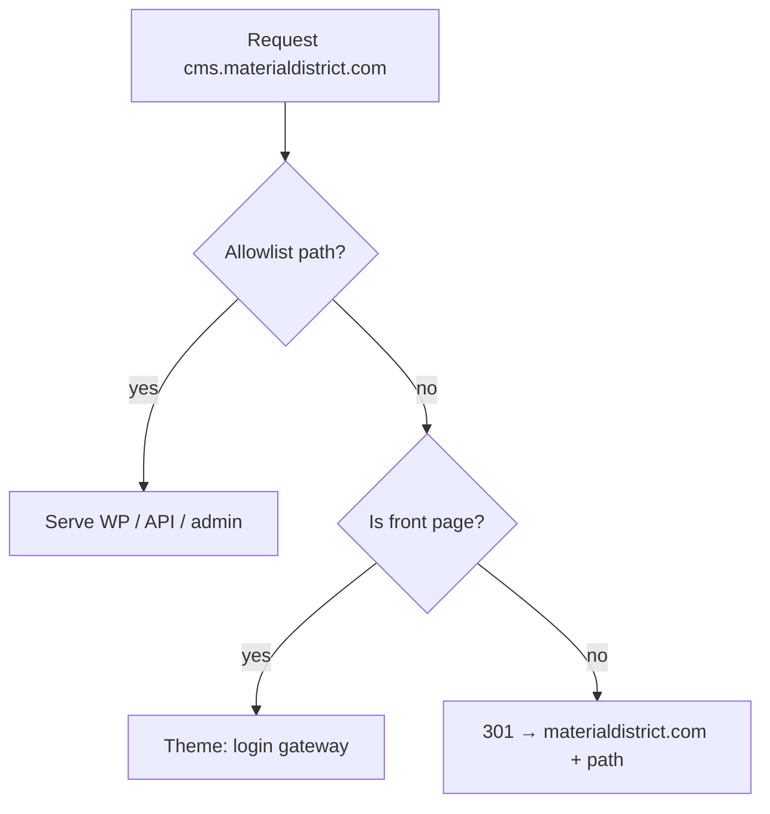

# Plan — CMS lockdown theme (`materialdistrict-cms-theme`)

**Datum:** 6 augustus 2026  
**Status:** uitgevoerd (variant A: same-path 301) — live 6 augustus 2026  
**Repo:** https://github.com/vanderwijk/materialdistrict-cms-theme (nieuw / apart)  
**Bronbrief:** [`note-cms-lockdown-theme-2026-08-06.md`](./note-cms-lockdown-theme-2026-08-06.md) in de frontend-repo

---

## Doel

Op `cms.materialdistrict.com` geen publieke content meer tonen (bots, duplicate content, bezoekersverwarring), terwijl Next.js, Stripe/PayPal, WooCommerce Store API, Sendcloud en cron gewoon blijven werken.

---

## Beslissingen (defaults)

| Keuze | Default in dit plan |
|-------|---------------------|
| UI-oppervlak | Nieuw minimal theme in aparte repo `materialdistrict-cms-theme` |
| Homepage `/` | Mini login/gateway (editors → wp-login / wp-admin); geen content |
| Content-URL’s | **301 same-path** naar `https://materialdistrict.com{path}` *(variant A — bevestigen)* |
| View/permalinks in wp-admin | Herschrijven naar `MD_FRONTEND_URL` via **plugin**-filters (niet alleen theme) |
| `siteurl` / `home` / `rest_url` | Blijven op CMS — geen blanket `home_url`-rewrite |
| SEO | `noindex,nofollow` op alle CMS-HTML + `robots.txt` Disallow voor front (API/uploads blijven bereikbaar) |

---

## Architectuur

```text
Anoniem / geen edit-cap
  GET cms…/material/foo/  →  301 materialdistrict.com/material/foo/
  GET cms…/               →  theme homepage (login gateway)

Editors (edit_posts+) op /
  → knoppen: wp-admin, frontend, logout

Altijd open (geen front-redirect):
  /wp-json/*  /wp-admin/*  /wp-login.php  /wp-cron.php
  admin-ajax.php  /wp-content/uploads/*
  (XML-RPC uit laten / geblokkeerd houden)
```



---

## Repo & theme-inhoud

**Repository:** `vanderwijk/materialdistrict-cms-theme`  
**Deploy-pad op CMS:** `/var/www/html/wp-content/themes/materialdistrict-cms-theme`

Minimale bestanden:

| Bestand | Rol |
|---------|-----|
| `style.css` | Theme header (`Theme Name: MaterialDistrict CMS`) |
| `functions.php` | Allowlist helpers, `template_redirect`, robots, body class |
| `index.php` | Fallback → redirect of gateway |
| `front-page.php` / `home.php` | Login gateway UI |
| `header.php` / `footer.php` | Minimaal HTML-shell |
| `robots.txt` theme support via `do_robots` filter of `robots_txt` |
| `README.md` | Activate checklist + allowlist + rooktest |

Geen templates voor `single-*`, archives, page-templates — alles wat toch matcht valt onder redirect.

---

## Allowlist (mag NOOIT front-redirecten)

Exact / prefix (implementatie via `template_redirect` early exit):

- `/wp-json` en alles eronder (incl. `md/v2`, `wc/store`, `wc/v3`, Stripe webhook, SES)
- `/wp-admin`
- `/wp-login.php`, `/wp-register.php` (indien relevant)
- `admin-ajax.php`, `admin-post.php`
- `wp-cron.php`
- `/wp-content/uploads/` (media; CDN mag parallel blijven)
- Optioneel: `/xmlrpc.php` → **403** i.p.v. redirect (dichttimmeren)

**Niet** redirecten op REST methodes of wanneer `REST_REQUEST` / `wp_is_json_request()`.

Sendcloud / payment gateways: hangen aan WC REST + admin + bestaande `headless-frontend-urls.php` (return URL’s al naar Vercel). Theme mag die niet raken.

---

## Homepage = editor gateway

Voorstellen UI (minimal, geen marketing):

- Titel: “MaterialDistrict CMS”
- Korte tekst: content leeft op materialdistrict.com; dit domein is alleen voor redactie/API
- Als uitgelogd: form of knop **Log in** → `wp-login.php?redirect_to=…/wp-admin/`
- Als ingelogd + `edit_posts`: knoppen **Dashboard**, **Open site** (`MD_FRONTEND_URL`), **Logout**
- `noindex` meta + `X-Robots-Tag` op HTML-responses vanuit theme

Geen publieke contentlijsten, geen menu’s naar materials/stories.

---

## Plugin-aanvulling (materialdistrict-plugin)

Theme alleen is niet genoeg voor “View” in wp-admin. Uitbreiden van bestaande [`headless-frontend-urls.php`](../../Local%20Sites/materialdistrict/app/public/wp-content/plugins/materialdistrict-plugin/headless-frontend-urls.php) (of nieuw `includes/md-cms-frontend-links.php`):

Filters (alleen admin/UI-context, niet `rest_url`):

- `post_type_link`, `page_link`, `post_link`, `attachment_link` → frontend path map
- `preview_post_link`, `get_sample_permalink` / `preview_post_link`
- Admin bar “View” / “Visit Site” → frontend
- Optioneel: `wp_redirect` naar frontend bij “View post” buttons

Path-map hergebruiken waar mogelijk (`material` → `/material/{slug}/`, `article` → `/article/…`, `brand`, `event`, `talk`, `product`/`book` → `/book/…`).

Definieer ontbrekende `md_frontend_permalink_for_post()` (mail-assembler roept die al aan).

Constant: `MD_FRONTEND_URL` = `https://materialdistrict.com` (al in wp-config).

---

## SEO / bots

1. Theme: `wp_robots` / `wp_head` → `noindex, nofollow` op alle front HTML  
2. `robots_txt` filter: Disallow `/` maar **niet** `/wp-json/` en idealiter uploads toestaan of via media-host  
3. Response header op front HTML: `X-Robots-Tag: noindex, nofollow`  
4. Na activatie: Search Console CMS-property controleren; eventueel CMS uit property / removal

---

## Activatie op productie

1. Repo clonen/deployen naar `wp-content/themes/materialdistrict-cms-theme`  
2. Plugin-update met frontend-link filters deployen  
3. Theme activeren (WP-admin Appearance) — **niet** network-wide issues op andere blogs als multisite-restanten bestaan; verifiëren dat alleen CMS-site dit theme gebruikt  
4. Oude `materialdistrict-theme` laten staan (rollback), niet verwijderen tot rooktest OK  
5. Checklist + lockdown-notitie afvinken

---

## Rooktest (verplicht)

| Test | Verwacht |
|------|----------|
| Anoniem `GET /` | 200 gateway óf login — geen materials-grid |
| Anoniem `GET /material/rivets/` | 301 → `https://materialdistrict.com/material/rivets/` |
| `GET /wp-json/` | 200, JSON |
| `GET /wp-json/md/v2/…` (bekende route) | werkt |
| `GET /wp-json/wc/store/v1/products` | werkt |
| Stripe webhook URL | bereikbaar (POST smoke / dashboard delivery) |
| wp-login + wp-admin | login OK |
| View material in admin | link wijst naar `materialdistrict.com/material/…` |
| Sendcloud admin connect / WC REST | geen regressie |
| Frontend cart/checkout | ongewijzigd |
| `curl -I` HTML pages | `X-Robots-Tag: noindex` of meta noindex |

---

## Rollback

Theme terugzetten naar `materialdistrict-theme` (+ plugin-filters desnoods achter feature-flag `MD_CMS_LOCKDOWN` of filter). DNS blijft cms → DigitalOcean.

---

## Buiten scope

- Multisite→single-site / books WP Engine opruimen  
- FacetWP-verwijdering  
- Volledige Caddy bot-block (aparte hardening; theme is HTML-laag)  
- `designerbooks.store`

---

## Besluit

**Variant A** (same-path 301) gekozen en live. Zie [`note-cms-lockdown-theme-2026-08-06.md`](./note-cms-lockdown-theme-2026-08-06.md).
